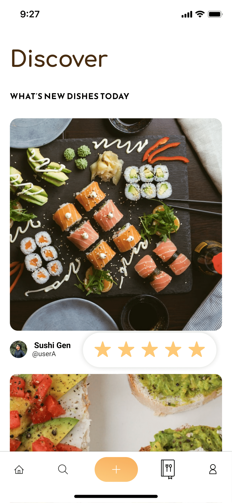

Original App Design Project - README
===

# Foodie

## Table of Contents
1. [Overview](#Overview)
1. [Product Spec](#Product-Spec)
1. [Wireframes](#Wireframes)

## Overview
### Description
Allows users to upload images of the restaurants they visit, as well as a star rating and a discover section that shows other people's restaurants ordered by proximity. 

### App Evaluation
- **Category:** Social Networking / Food
- **Mobile:** Allows users to post real time images of the food they are having at a specific restaurant. It stores the location of the image to work with proximity later on. It could also work for a desktop application but the main goal is to develop on mobiles for convenience and ease of use. 
- **Story:** Allows users to search for nearby restaurants and see pictures posted by other users that have already been at the location, with a star rating and comments. Gives the user a chance to Bookmark restaurants that they want to visit in the future. 
- **Market:** Individuals that enjoy trying out different food experiences or that want to share their findings with friends and other users. People looking for food related ideas. 
- **Habit:** The app could be used often by people that frequently dine out to find new restaurants. Another potential user are people that are traveling or moved recently to find good food spots. 
- **Scope:** For now, we would like to focus on a feed with other user's posts, basic user/restaurant profiles and a bookmark page. In the future Foodie could scale to "following" other users, allow users to create different pages on their own bookmark section, link to the restaurant's pages or provide reservation information, etc. 

## Product Spec

### 1. User Stories (Required and Optional)

**Required Must-have Stories**

* User can see people other user's images and ratings around the area
* User can post a new restaurant with photo and rating to the discover feed
* User can see their own profile with all the existing reviews and images they have posted
* Users can create account
* Users can log in
* Users can see the restaurant's page with all the posts created by other users and the average star rating
* Users can bookmark a restaurant of their liking and save it on their "Bookmarks" page

**Optional Nice-to-have Stories**

* Users can create different lists within their bookmark section
* Interactive map that shows all the restaurants with posts within the area
* Users can interact with the restaurant and check out their menu, website, how to make a reservation
* Searching by hashtag, search by user, search by restaurant name...
* Users can follow other users and only see their postings instead of discover
* Users can view other user's profiles and their restaurant postings

### 2. Screen Archetypes

* Login/Resgister
   * User can create account
   * User can log in
* Discover Feed
   * User can see people other user's images and ratings around the area
* Posting
    * User can post a new restaurant with photo and rating to the discover feed
* User Profile
    * User can see their own profile with all the existing reviews and images they have posted
        * Detailed Posts Page
        * Images Only Page
* Restaurant Profile
    * Users can see the restaurant's page with all the posts created by other users and the average star rating
* Bookmarks
    * Users can bookmark a restaurant of their liking and save it on their "Bookmarks" page
### 3. Navigation

**Tab Navigation** (Tab to Screen)

* Feed
* Search (NTH)
* Post
* Bookmarks
* User Profile

**Flow Navigation** (Screen to Screen)

* Login/Register
   * Discover Feed
* Discover Feed
   * Restaurant Profile
* User Profile
    * Posts
    * Feed
    * Bookmarks
* Posting
    * Discover Feed

## Wireframes
Completed with figma. Visit: [Figma](https://www.figma.com/file/eJfL7WNLPKEzBeorTCIG7I/Prototyping-in-Figma?node-id=0%3A1&t=85HIRKXqrNsZTlsW-1)

### [BONUS] Digital Wireframes & Mockups

### [BONUS] Interactive Prototype

### This is not due until the following week: 
## Schema 
[This section will be completed in Unit 9]
### Models
[Add table of models]
### Networking
- [Add list of network requests by screen ]
- [Create basic snippets for each Parse network request]
- [OPTIONAL: List endpoints if using existing API such as Yelp]
